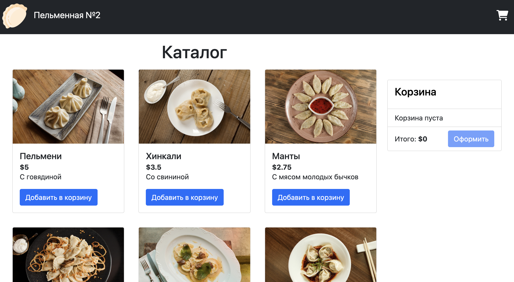

# Momo Store - Интернет магазин вкусных пельменей взятые из репозитория Стасяна. Покупайте наши пельмени и будете довольны!

## Пельменная №2 
URL сайта http://89.169.163.211:30080/momo-store/catalog

## О проекте
Momo Store — интернет-магазин "Пельменная №2". Репозиторий содержит фронтенд (Vue.js), бэкенд (Go API) и инфраструктуру для Kubernetes с Terraform и Helm. Реализован CI/CD pipeline с проверкой безопасности и автоматическим деплоем.

## Инфраструктура
````
momo-store/
├── backend/                 # Golang бэкенд
│   ├── cmd/api/             # Точка входа приложения
│   ├── internal/            # Внутренние пакеты
│   ├── Dockerfile           # Docker образ бэкенда
│   └── metrics.go           # Метрики Prometheus
├── frontend/                # Vue.js фронтенд
│   ├── public/              # Статические файлы
│   ├── src/                 # Исходный код
│   └── Dockerfile           # Docker образ фронтенда
├── img/                     # Изображения для README и фронтенда
│   └── 1.png
├── infrastructure/          # Инфраструктура как код
│   ├── k8s/                 # Kubernetes манифесты
│   │   ├── backend-deployment.yaml   # Деплой бэкенда
│   │   ├── frontend-deployment.yaml  # Деплой фронтенда
│   │   ├── ingress.yaml               # Основной Ingress
│   │   ├── ingress-correct.yaml       # Исправленный Ingress
│   │   └── ingress-fixed.yaml         # Финальная версия Ingress
│   ├── kubernetes/          # Базовые конфигурации k8s
│   │   └── momo-store-with-metrics.yaml  # Ресурсы с метриками
│   ├── monitoring/          # Мониторинг: Grafana, Prometheus, Loki
│   │   ├── kubernetes-dashboard.yaml     # Дашборд Kubernetes
│   │   ├── loki-values.yaml              # Конфиг Loki
│   │   ├── momo-store-dashboard.yaml     # Дашборд приложения
│   │   ├── prometheus-stack.yaml         # Стек Prometheus
│   │   └── setup-monitoring.sh           # Скрипт развертывания мониторинга
│   ├── nexus/               # Репозиторий Nexus
│   │   ├── nexus-deployment.yaml # Основной деплой Nexus
│   │   ├── nexus-deployment-init.yaml # Инициализация и первоначальная настройка Nexus
│   │   ├── nexus-deployment-simple.yaml # Минимальный деплой для тестов
│   │   └── nexus-deployment-fixed.yaml # Финальная исправленная версия деплоя Nexus
│   └── terraform/           # Terraform инфраструктура + CI/CD
│       ├── modules/disabled              # Отключённые модули Terraform
│       ├── .gitignore                     # Игнорируемые файлы для Terraform
│       ├── .terraform.lock.hcl           # Lock-файл провайдеров Terraform
│       ├── backend.tf                      # Конфигурация backend для хранения состояния в S3
│       ├── go-deps-report.json            # Отчёт зависимостей Go для CI/CD
│       ├── main.tf                         # Основной Terraform конфиг (ресурсы, провайдеры)
│       ├── npm-audit-report.json          # Отчёт проверки npm-пакетов (CI/CD)
│       ├── sonar-project.properties       # Конфигурация SonarQube для анализа кода
│       ├── terraform.tfstate              # Состояние Terraform
│       ├── terraform.tfstate.backup       # Резервная копия состояния Terraform
│       ├── terraform.tfvars               # Значения переменных для Terraform
│       ├── tfplan                         # План Terraform (для применения изменений)
│       └── variables.tf                   # Определение переменных Terraform
├── .gitignore               # Игнорируемые файлы для git
├── .gitlab-ci.yml           # CI/CD конфигурация
├── README.md                # Этот файл
└── setup-corporate-nexus-docker.sh # Скрипт настройки Nexus для CI/CD
````

## Backend
```
cd backend
docker build -t momo-backend .
docker run -p 8080:8080 momo-backend
```

## Frontend
```
cd frontend
docker build -t momo-frontend .
docker run -p 80:80 momo-frontend
```

## Деплой в Kubernetes
```
kubectl apply -f infrastructure/k8s/backend-deployment.yaml
kubectl apply -f infrastructure/k8s/frontend-deployment.yaml
kubectl apply -f infrastructure/k8s/ingress.yaml
```
Проверка
```
kubectl get pods
kubectl get svc
kubectl get ingress
```

## Мониторинг
```
kubectl apply -f infrastructure/monitoring/prometheus-stack.yaml
kubectl apply -f infrastructure/monitoring/loki-values.yaml
kubectl apply -f infrastructure/monitoring/momo-store-dashboard.yaml
```

## Nexus
```
kubectl apply -f infrastructure/nexus/nexus-deployment.yaml
```
Настройка
```
bash setup-corporate-nexus-docker.sh
```
## Terraform

В файле infrastructure/terraform/terraform.tfvars задать значения:
```
yandex_cloud_id

yandex_folder_id

yandex_zone

yandex_token

s3_access_key

s3_secret_key
```
Применение
```
cd infrastructure/terraform
terraform init
terraform plan
terraform apply
```
## CI/CD
Файл .gitlab-ci.yml включает:
Основные переменные, которые используются:

| Key                  | Описание                       |
| -------------------- | ------------------------------ |
| CI_REGISTRY          | GitLab registry URL            |
| CI_REGISTRY_IMAGE    | GitLab image URL               |
| CI_REGISTRY_USER     | Логин для registry             |
| CI_REGISTRY_PASSWORD | Пароль для registry            |
| KUBE_CONFIG          | base64-encoded kubeconfig      |
| KUBE_NAMESPACE       | namespace для деплоя           |
| KUBE_SERVER          | API server кластера            |
| KUBE_TOKEN           | Токен для деплоя               |
| NEXUS_USERNAME       | Пользователь Nexus             |
| NEXUS_PASSWORD       | Пароль Nexus                   |
| NEXUS_URL            | URL корпоративного репозитория |
| S3_ACCESS_KEY        | Доступ к Object Storage        |
| S3_SECRET_KEY        | Секрет для S3                  |
| S3_BUCKET_NAME       | Имя бакета                     |
| S3_ENDPOINT_URL      | URL S3                         |


